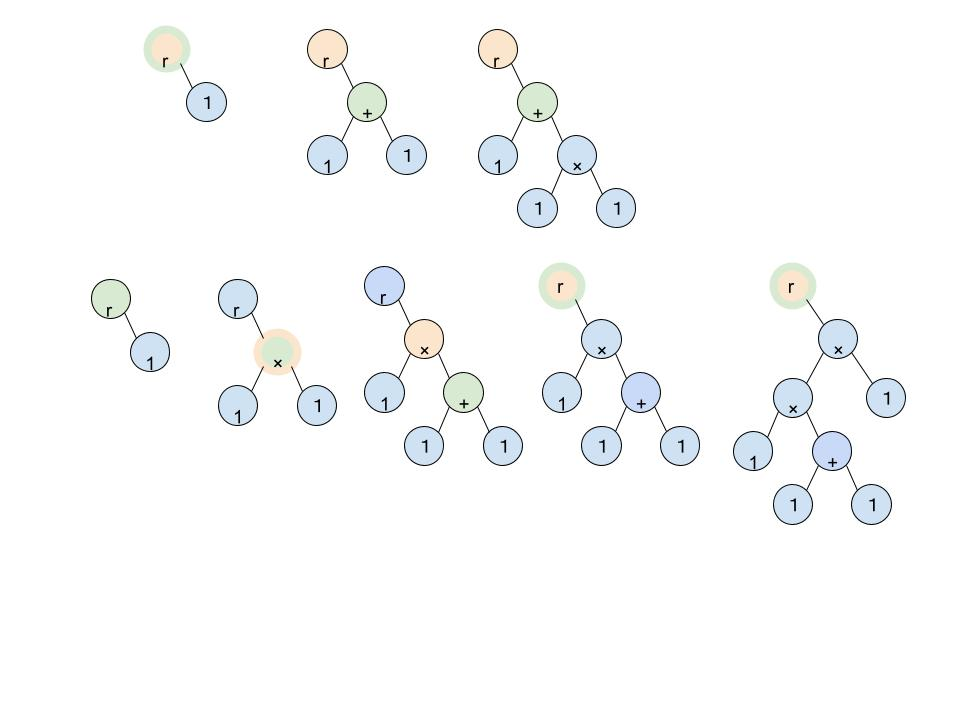

電卓プログラム
=
# 目的
* std::stringで与えられた計算式に対し計算結果を出力する
* 数字 ' + ' ' - ' ' * ' ' / ' ' ( ' ' ) 'に対応
* module化して機能の追加をしやすくする
# 概要
## 全体の流れ
1. 1行を数字や演算子に分割
2. 構造体Tokenに変換
3. Nodeを木に追加
4. 木から答えを計算
## 1. 1行を数字や演算子に分割
### formatLine()
* stringを処理しやすいように整形
    * -, + から始まったら初めに0をつけるなど 
### readLine()
* stringを読み込んでいき、文字ごとに以後の操作を実行
## 2. 文字列の分割
### Token
* NUMBER(数字), PRIOR(* /), NON_PRIOR(+ -)のTagを持つ
* NUMBERの場合は、value(int)を持つ
* PRIOR, NON_PRIORの場合はstd::function<double(double, double)>を持つ
## 3. 木の構成
### Node
* 木の要素になる
* Token, parent, left, rightを持つ
* 以後の操作で必要な関数をメンバにもつ
    * insert(object) : this->rightにobjectを挿入し、this->rightが存在すれば、object->leftに移動
    * getValue : 各nodeのleft, rightの値にtokenの演算子を適用する
### AdminTree
* 木を管理する
* root, prior_insert_point, non_prior_insert_point, bracketを持つ
* 新しく作られたnodeをどこのnodeの右に挿入すべきかを返す
### insertNode()
* tokenをもとにnodeをつくる
* 木構造に挿入する
## 4. 答えの計算
* mainでroot->getValue()を実行し、再帰的に答えを計算する
## 木構造について補足
### 基本的な流れ
* '+' '-'  はnon_prior_insert_pointの下、'*' '/' 数字 はprior_insert_pointの下に挿入する
* prior_insert_pointは新たに演算子+-*/を挿入した時にそのnodeに更新する
### ()の処理
* '('が追加されると、bracketというstackに現状のprior_insert_pointが入れられる
* ')'が閉じると、non_prior_insert_pointがstack.top()で更新され、stack.pop()される
    * 直後に掛け算割り算が来るときは、最後に追加した演算子の右要素ではなく、直前に閉じた()に対して実行される
* prior_insert_pointはbracket.empty() ? root : bracket.top()となる
    * 掛け算割り算は'('の始まりの下に適応されるようになる
### 図
* 上に 1 + 1 * 1 の木、下に 1 * ( 1 + 1) * 1 の木を左から順に構成していった様子を示した
* 緑がprior_insert_point、オレンジがnon_prior_insert_pointである

# 工夫した点(機能拡張について)
* +-, あるいは×÷と同様の優先度と引数を持った演算子の追加は、以下の2つの操作のみで可能である
    * read_token(std::function<double(double, double)>を持つtokenを返す関数)の追加
    * read_lineへの場合分けの追加
* 異なる優先度を持った演算子の追加は、上記の操作に加え、以下の操作を行えば可能である
    * Tag, Tokenでtagの追加
    * AdminTree, insertNodeでの優先度の追加
* 異なるargument 数(1つ)を持つ演算子の追加は、以下の操作を行えば可能である
    * 架空のargumentを作成し、leftに追加。本物のargumentはrightに追加
* このようにmodule化によって大きく構造を変えることなく、機能拡張をできる。

# 使用方法
* main.shを使用
* Press is_testcaseと聞かれるので、
    * 1と入力したら、testcase.txtに対して計算が行われる
    * 1以外を入力したら、計算式を入力するごとに計算結果が標準出力され、exitと入力するとプログラムが終了する