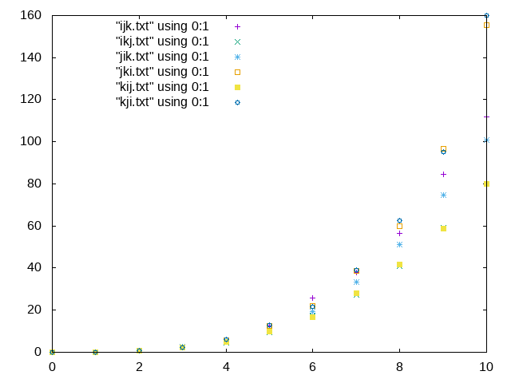

行列積のループ順序
=

# 結果
```
./auto.sh
```
## データ
* ***.txt
* 0 × 0行列、10 × 10 行列、 ... 、100 × 100 行列の10回の実行時間の合計を各行列に出力
## グラフ
x軸：行数 ÷ 100 \
y軸：実行時間 × 10 


## 実行時間の比較
k-j-i, j-k-i >>  i-j-k > j-i-k >> i-k-j, k-i-j 
# 考察
```
for(1){
    for(2){
        for(3){
            c[i][j] += a[i][k] * b[k][j]
        }
    }
}
```
* 最内ループでjを変化させるとき、c[i][j], b[k][j]はjに対してメモリが連続で、a[i][k]はjによらず一定なので、キャッシュヒット率が高いため速い
* 最内ループでiを変化させるとき、b[k][j]は一定だが、c[i][j], a[i][k]は飛び飛びに変化するので、遅い
* 最内ループでkを変化させるとき、c[i][j]は一定で、a[i][k]は連続に変化する。b[k][j]は飛び飛び。
    * このとき、jを最外ループで変化させた方が、iを変化させていく中で最内ループでのb[k][j]の変化が規則的になって速くなる(?)
