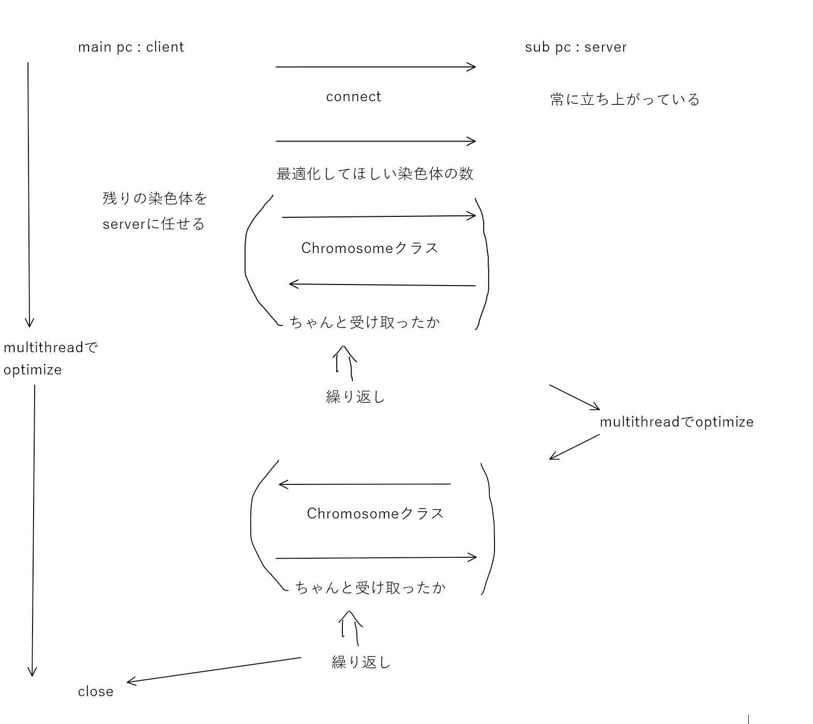

TSP
=
# 概要
1. Genetic Algorithm による大域的な探索
2. 2-opt, 3-opt などによる局所的最適化
3. multi threadと分散処理(ソケット通信を使用)による高速化

# Genetic Algorithmについて
* 下記の文献の理論に準拠して実装した
>前川景示, 玉置久, 喜多一, & 西川〓 一. (1995). 遺伝アルゴリズムによる巡回セールスマン問題の一解法. 計測自動制御学会論文集, 31(5), 598-605.

## 全体像
```
MacroGene -> Chromosome -> GeneticAlgorithm
```
の順にレイヤが高くなっている
## 遺伝子
* codon1, codon2を結ぶ辺を表す

## 染色体
* 一周する経路を表す
* MacroGeneを都市(点)の数だけ並べたもの
* 最適化関数や、突然変異の関数、指定されたように経路を入れ替える関数など、Genetic Algorithm をサポートする関数をメンバに持つ
## 世代交代
* Chromesomeを個体数だけ持つ
### 世代交代の流れ
1. 初期世代unit_nowの構成 (個体数：N_p1)
2. 次の世代構成のためのunit_nextの構成(個体数：N_p2)
3. unit_next間の交叉、突然変異
4. 交叉、突然変異後の最適化
5. 総距離が短いbest N_p1をもとに次の世代を選択・構成(unit_nowに置き換え)
6. 2~繰り返し
### unit_nextの構成
* 総距離の3乗に比例する個体ごとのfitnessに比例して個体数をN_p1からN_p2に増やした
### 交叉
* 2つの染色体の遺伝子を一つずつ交換していく
    * それにともなって、それぞれの経路の一部を反転させる
* codon1, codon2が共に一致したら終了(両方の染色体が都市を1周する経路になるので)
* 詳しくは論文を参照
### 突然変異
* ランダムに選んだ二点を交換し、その間を反転させるという操作を5回繰り返した
### 選択
* 最適化後の総距離が短いN_p1個を選んだ
* 距離の差が0.2mm以下の異なる経路は存在しないと仮定し、距離をもとにして同じ染色体が新しい世代に複数入らないようにした

# 局所最適化について
* 内容はopt directoryと同様
* 最後に残った世代を最適化する際は、opt directoryと同様のtsp.cppを使用した
* selectionの前の最適化では、Chromosomeクラス内で簡潔するように、メンバ関数として、two-opt, one_move, two_moveを実装した。
    * アルゴリズムは同様で、経路の管理方法だけ異なる
# ソケット通信を用いた分散処理について
* 通信部分の実装は以下のサイトを参考にした
> https://tora-k.com/2019/08/27/socket-c/
* selectionの前にoptimizeする際、各染色体に独立に最適化を行うことから、分散並列処理を用いた。
* 以下のプロトコル(のようなもの)に基づいて分散処理を行った

* 1024bite前後しか確実に送れなかったので、chromosomeクラスをポインタで分割して送信した
* 全ての世代交代終了後の最適化でも分散処理を用いているが、最適化後にChromosomeクラスを返すのではなく、最適化後の総距離を返すという違いがある
# 実行方法
1. 使用するinput file番号と、chromosomeクラスをsocket通信で送る際の分割数をmain.cpp, server_for_ga.cpp, ga.hppの冒頭に代入
2. server pcのipアドレスを代入
3. 実行
* @main pc
```
g++ -std=c++2a -O3 main.cpp tsp.cpp -pthread -o main.out
./main.out
```
* @sub pc
```
g++ -std=c++2a -O3 server_for_ga.cpp tsp.cpp -pthread -o server.out
./server.out
```
# 結果
* best_score : 40862.4
* seed : -1967621186 (default_random_engineに渡したもの)