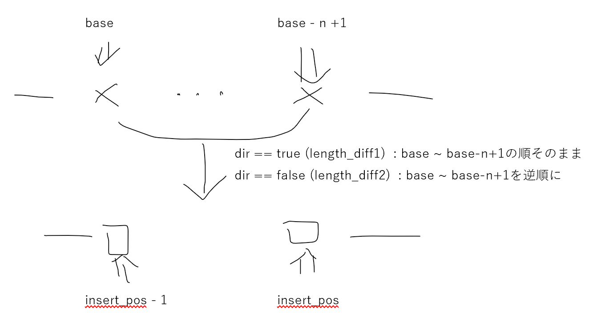
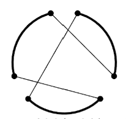
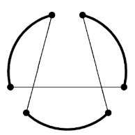
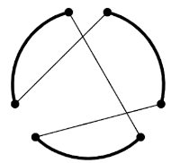
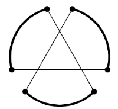
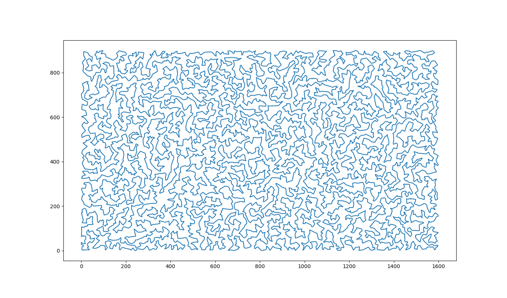
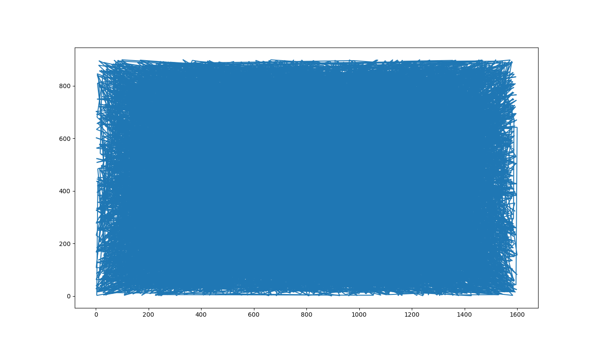

局所最適化
=

# 概要
1. fileの読み込み・Pointの登録
2. 入力順に繋いだ時の総距離(初期値)を求める
3. 最適化

# 最適化の手法について
1. two-opt
* 2点を入れ替え、その間の点を逆向きにしたら、全体距離が短くなる場合に入れ替え
2. one-move, two-move, three-move, four-move
* 連続n点の位置を別の2点間に移動したら全体距離が短くなる場合に移動
* n >= 2に関しては変数dirを次のように定義した

3. three-opt
* 3点を入れ替え、その間の点の向きを適宜変更したら、全体距離が短くなる場合に入れ替え
* tsp.cpp上での変数dirに対応を下図に書く
    * 左上の点から順に、indexをswap1 - 1, swap1, swap2 - 1, swap2, swap3 - 1, swap3と置いてプログラムで使用した
    * dir1

    * dir2

    * dir3

    * dir4

    * homework review5の図を借りた
# その他
## 3-optのtime outについて 
* 8092点あると計算が終わらなかったので、全探索ではなく、始点をランダムに決め、そこから20分以内でできるところまで探索するようにした
* 再現性のために、どこでタイムアウトしたかを出力した
## visualize.pyについて
* 点の総数を冒頭に、それ以降に点の座標を訪問順に入力したファイルを渡すと、経路を見られるようにした
```
python3 visualize.py ***.csv
```

# 方法
* main.shを実行
* file番号を一度入力
# 結果
## 小さい入力に対してためにエラーが起こる
* セグフォ(ex. seed 1997265758, input3)
    * gdbで見ると...
```
__memmove_avx_unaligned_erms () at ../sysdeps/x86_64/multiarch/memmove-vec-unaligned-erms.S:500
500     ../sysdeps/x86_64/multiarch/memmove-vec-unaligned-erms.S: No such file or directory.
```
* 無限ループらしきもの
    * two-opt やfour moveなどいろいろな場所で
* 提出前に気づいたこともあり、解決できていないです
* input7.csvに対してはこのようなことは今のところ起こりませんでした
## データ
* best_score : 82727.6
* seed : 1016666745
* 途中のtimeout
```
156 from 7816
5666 from 4581
3930 from 3423
5068 from 4220
599 from 416
79 from 5632
3716 from 3215
1486 from 1251
3108 from 2718
2936 from  2568
164 from 7554
225 from 56
918 from 717
304 from 132
7240 from 4957
1206 from 988
90 from 5710
48 from 5320
4091 from 3516
167 from 7821
```
## グラフ
* opt後

* opt前


